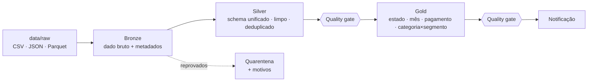

# Opção A - Pipeline ShopBrasil - DataFlow Analytics

**Projeto Final · Big Data Processing · MBA em Engenharia de Dados - Universidade Presbiteriana Mackenzie**
Professor: Alexandre Tavares

## O case

**Problema.** A DataFlow Analytics precisa entregar um pipeline de produção para seu cliente **ShopBrasil**. O pipeline deve processar as vendas diárias, aplicar regras de qualidade e gerar métricas de negócio para o dashboard executivo.

**Solução.** Um pipeline em arquitetura **Medallion** (Bronze → Silver → Gold), processado com **PySpark**, orquestrado pelo **Airflow** e empacotado em **Docker Compose**. Ele lê as vendas da ShopBrasil em três formatos (CSV, JSON e Parquet), mais os cadastros de clientes e de categorias, aplica **regras de qualidade com quarentena** e publica as **métricas de negócio** em Parquet.

| Requisito da Opção A | Como o projeto atende |
|---|---|
| Ingestão: pelo menos 2 fontes em formatos diferentes | Vendas em CSV, JSON e Parquet + clientes (Parquet) + categorias (JSON) |
| Bronze: dados brutos com `_source` e `_ingestion_ts` | `spark_jobs/ingestao.py` (inclui também `_source_file` e `_batch_id`) |
| Silver: normalização de schema, nulls, deduplicação | `spark_jobs/transformacao.py` |
| Gold: faturamento por estado + análise mensal | `spark_jobs/agregacao.py` (mais faturamento por pagamento e por categoria × segmento) |
| Qualidade: completude, unicidade, domínio + quarentena | `quality/checks.py` (mais consistência e integridade referencial) |
| Orquestração: sensor → spark job → quality checks → notificação | `dags/pipeline.py` (10 tasks) |
| Docker: `docker compose up` sobe tudo | `docker-compose.yml` + `Dockerfile` |

```
docker compose up -d --build   →   sensor → Bronze → Silver → quality gate → Gold → quality gate → notificação
```

## Integrantes


| Nome | RA |
|---|---|
| Adriana Cirelli | 10756333 |
| Rafaela Catharina Pechtoll Pereira | 10755272 |
| Jessica da Silva Oliveira | 10391085 |
| Pamella Bezerra da Silva | 10752643 |
---

## Como rodar

Há duas formas. As duas usam o mesmo `docker-compose.yml`, e os dados de entrada já estão no repositório (`data/raw/`), então não é preciso baixar nada.

### Opção 1 - GitHub Codespaces (recomendada: nada para instalar)

1. No GitHub do projeto: **Code → Codespaces → ⋯ → New with options**.
2. Em *Machine type*, escolha **4-core** (16 GB RAM) → **Create codespace**.
3. Aguarde. O Codespace já roda `docker compose up -d --build` sozinho. A primeira vez leva de 5 a 8 minutos; acompanhe no terminal com `docker compose ps`.
4. Aba **PORTS** → porta **8080** → 🌐 abre o Airflow. A 4040 é a Spark UI (só aparece enquanto um job roda).

### Opção 2 - Docker na própria máquina

**Pré-requisitos:** Docker Desktop (ou Docker Engine) com Compose 2.x, 8 GB de RAM livres para o Docker, 4 CPUs, ~5 GB de disco. Portas **8080** e **4040** livres.

```bash
git clone https://github.com/bepam/Bigdata-project-dataflow.git
cd Bigdata-project-dataflow

# Somente Linux: arquivos gerados ficam com o seu usuário
echo "AIRFLOW_UID=$(id -u)" > .env

docker compose up -d --build
```

A primeira subida constrói a imagem (Airflow + Java + PySpark), leva de 3 a 6 minutos e precisa de internet. As próximas sobem em segundos.

### Depois que o ambiente subiu (vale para as duas opções)

1. Abra o Airflow (**http://localhost:8080** no Docker local, ou a porta 8080 da aba PORTS no Codespaces) → usuário `admin`, senha `admin`.
2. A DAG **`shopbrasil_pipeline_vendas`** já aparece **ativa** e dispara sozinha na primeira subida. Para rodar de novo: botão ▶ **Trigger DAG**.
3. Durante os jobs Spark, a Spark UI fica em **http://localhost:4040**.
4. Ao final (~2 minutos), veja os resultados no terminal:

```bash
docker compose exec airflow-scheduler python scripts/mostrar_resultados.py
# seções: --secao fluxo | gates | quarentena | gold
```

**Parar / limpar**

```bash
docker compose down              # para os containers (mantém dados e histórico)
docker compose down -v           # também apaga o banco do Airflow
rm -rf data/bronze data/silver data/gold data/quarentena data/quality data/notificacoes logs
```

---

## Arquitetura



Detalhes completos (diagramas da DAG, contrato de cada camada, regras de qualidade e decisões): **[docs/arquitetura.md](docs/arquitetura.md)**.

### Dados

Conforme o enunciado, usamos os **datasets do curso** (pasta `datasets/` do [repositório da disciplina](https://github.com/AleTavares/Mackenzie_BigDataProcessing)), com o conteúdo sem alteração, em `data/raw/`:

| Dado | Pasta em `data/raw/` | Formato | Registros |
|---|---|---|---:|
| Vendas | `vendas_csv` (3 arquivos) | CSV ISO-8859-1, separador `;`, colunas em português | 6.871 |
| Vendas | `vendas_json` (3 arquivos) | JSON (registros dentro de `data[]`) | 30.000 |
| Vendas | `vendas_parquet` (1 arquivo) | Parquet | 80.000 |
| **Total de vendas** | | | **116.871** |
| Clientes | `clientes` | Parquet | 500.000 |
| Categorias | `categorias` | JSON aninhado (categorias → subcategorias) | 10 categorias |

Todos os `customer_id` das vendas existem no cadastro de clientes. Como o JSON de categorias não traz `product_id`, o produto é ligado à categoria por uma regra de catálogo: faixas de 500 produtos (`PROD_0001–0500` → `CAT_01`, …).

> Os dados são **sintéticos** (gerados para o curso) e cobrem o ano de 2023. Todos os números deste projeto saem do processamento desses arquivos pelo pipeline.

### Camadas

| Camada | Job | Saída |
|---|---|---|
| Bronze | `spark_jobs/ingestao.py` | `data/bronze/vendas/vendas_csv`, `…/vendas_json`, `…/vendas_parquet`, `data/bronze/clientes`, `data/bronze/categorias` |
| Silver | `spark_jobs/transformacao.py` | `data/silver/vendas` (partição `ano_mes`), `data/silver/clientes`, `data/silver/categorias`, `data/quarentena/vendas` |
| Gold | `spark_jobs/agregacao.py` | `data/gold/faturamento_por_estado`, `data/gold/analise_mensal`, `data/gold/faturamento_por_pagamento`, `data/gold/faturamento_categoria_segmento` |
| Qualidade | `quality/checks.py` | `data/quality/ultima_execucao/*.json`, `data/quality/historico/` |

### Qualidade de dados

- **5 dimensões por registro:** completude (11 campos obrigatórios), validade de domínio (status, forma de pagamento, UF, valores > 0, data em 2023), consistência (`total = qtd × preço`), integridade referencial (cliente existe no cadastro) e unicidade (`order_id`).
- **Quarentena funcional:** registro reprovado vai para `data/quarentena/vendas` com a lista de motivos (`_motivos`) e o motivo principal. O funcionamento está coberto pelos testes em `tests/test_checks.py`.
- **Conservação garantida:** `Bronze = Silver + Quarentena` (verificado a cada execução).
- **Quality gates bloqueantes:** se a Silver não passar, a Gold não é publicada; a Gold é reconciliada contra a Silver antes da notificação.

**Resultado:** os 116.871 registros passaram em todas as regras, então a quarentena fica **vazia (0 registros)** e a DAG segue pelo ramo `sem_pendencias`. Isso é um resultado real: os arquivos do curso não têm nulos, duplicatas, valores fora do domínio, totais inconsistentes nem clientes fora do cadastro.

### Regras aplicadas

| Regra | Valor |
|---|---|
| Faturamento | Soma de `total_amount` dos pedidos **não cancelados** |
| Campos obrigatórios da venda | Os 11 campos (pedido, cliente, produto, quantidade, preço, total, data, pagamento, cidade, UF, status) |
| Status válidos | `pending`, `shipped`, `delivered`, `cancelled` |
| Formas de pagamento válidas | `credit_card`, `debit_card`, `pix`, `boleto` |
| UF válida | Uma das 27 unidades da federação |
| Valores | Quantidade, preço unitário e total maiores que zero |
| Período | Data do pedido dentro de 2023 |
| Consistência | `total_amount = quantity × unit_price` (tolerância de R$ 0,01) |
| Cliente | `customer_id` precisa existir no cadastro de clientes |
| Duplicatas | Fica a primeira ocorrência de cada `order_id`; as demais vão para a quarentena |
| Categoria do produto | Faixas de 500 produtos por categoria |
| Limites dos quality gates | No máximo 10% das vendas em quarentena; no mínimo 50 mil vendas na Silver |
| Dados pessoais | Nome, e-mail e telefone do cliente não seguem para a Silver |

### Orquestração

`aguardar_arquivos_vendas` (sensor) → `bronze_ingestao` → `silver_transformacao` → `quality_gate_silver` → `gold_agregacao` → `quality_gate_gold` → `verificar_quarentena` (branch) → `alertar_quarentena` | `sem_pendencias` → `notificar_sucesso`

Retries com backoff, callback de falha, `max_active_runs=1` e parâmetros `taxa_quarentena_max` e `volume_minimo_silver` ajustáveis pela UI. Alertas e resumos são gravados em `data/notificacoes/` (simulando Slack/e-mail).

---

## Estrutura do repositório

```
Bigdata-project-dataflow/
├── README.md
├── .devcontainer/
│   └── devcontainer.json       # GitHub Codespaces (sobe tudo sozinho)
├── docker-compose.yml          # postgres + airflow-init + webserver + scheduler
├── Dockerfile                  # Airflow 2.8.4 + Java 17 + PySpark 3.5.1
├── requirements.txt
├── .env                        # AIRFLOW_UID
├── dags/
│   └── pipeline.py             # DAG shopbrasil_pipeline_vendas
├── spark_jobs/
│   ├── common.py               # caminhos, SparkSession, logging JSON, métricas
│   ├── ingestao.py             # Bronze
│   ├── transformacao.py        # Silver + quarentena
│   └── agregacao.py            # Gold
├── quality/
│   └── checks.py               # regras de linha, quarentena e quality gates
├── scripts/
│   └── mostrar_resultados.py   # resumo no terminal para a demo
├── tests/
│   └── test_checks.py          # testes unitários das regras de qualidade
├── conf/
│   └── log4j2.properties       # log do Spark enxuto
├── data/
│   └── raw/                    # vendas (CSV, JSON, Parquet) + clientes + categorias
└── docs/
    └── arquitetura.md          # diagramas e decisões
```

## Rodar sem Docker (desenvolvimento)

Requer Python 3.10+ e Java 17.

```bash
python -m venv .venv && source .venv/bin/activate
pip install pyspark==3.5.1 pandas pyarrow pytest
export DATA_DIR=$(pwd)/data PYTHONPATH=$(pwd) SPARK_CONF_DIR=$(pwd)/conf

pytest -q tests/                                     # testes das regras
spark-submit spark_jobs/ingestao.py
spark-submit spark_jobs/transformacao.py
spark-submit quality/checks.py --camada silver
spark-submit spark_jobs/agregacao.py
spark-submit quality/checks.py --camada gold
python scripts/mostrar_resultados.py
```

## Stack

| Tecnologia | Versão |
|---|---|
| Python | 3.11 |
| Apache Spark (PySpark) | 3.5.1 |
| Apache Airflow | 2.8.4 (+ provider apache-spark 4.7.1) |
| PostgreSQL (metadados Airflow) | 13 |
| Docker Compose | 2.x |
| Formato de saída | Parquet (Snappy) |

## Problemas comuns

| Sintoma | Solução |
|---|---|
| Codespaces: página do Airflow não abre | Aguarde `docker compose ps` mostrar o webserver *healthy*; na aba PORTS, clique no 🌐 da 8080 de novo |
| Codespaces: ambiente não subiu depois de reabrir | No terminal: `AIRFLOW_UID=$(id -u) docker compose up -d` |
| Porta 8080 ocupada | Pare o outro serviço ou troque `"8080:8080"` por `"8081:8080"` no compose |
| `Permission denied` em `data/` (Linux) | `echo "AIRFLOW_UID=$(id -u)" > .env` e `docker compose up -d --force-recreate` |
| DAG não aparece | `docker compose logs airflow-scheduler`; aguarde ~30 s após o webserver ficar *healthy* |
| Task Spark com `Java gateway process exited` | Docker com pouca memória: reserve ao menos 6 GB em *Settings → Resources* |
| Quero ver o gate reprovando | *Trigger DAG w/ config* → `volume_minimo_silver = 200000` |
