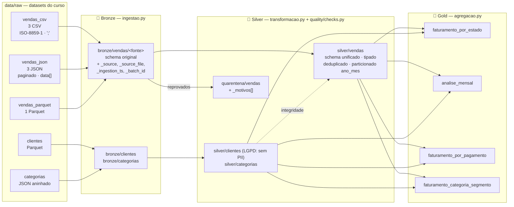
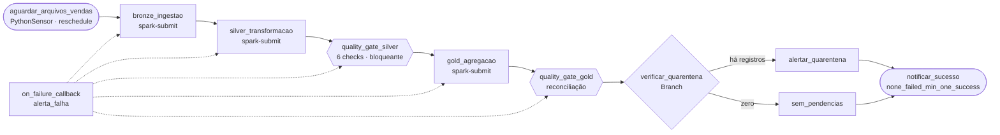

# Arquitetura — Pipeline ShopBrasil (DataFlow Analytics)

## 1. Visão geral

## 2. Orquestração (DAG `shopbrasil_pipeline_vendas`)

| Recurso Airflow | Onde |
|---|---|
| Sensor | `PythonSensor` em modo `reschedule` (não ocupa slot enquanto espera) |
| Spark | `SparkSubmitOperator` com conexão `spark_local` (`local[2]`) |
| Branching | `BranchPythonOperator` decide se alerta sobre a quarentena |
| Retries | 2 tentativas, backoff exponencial a partir de 30 s |
| Callback | `alerta_falha` grava alerta em `data/notificacoes/` |
| Templates | `{{ ds }}` e `{{ run_id }}` viram `--data-ref` / `--run-id` dos jobs |
| Params | `taxa_quarentena_max` e `volume_minimo_silver` ajustáveis em *Trigger DAG w/ config* |
| Concorrência | `max_active_runs=1` (camadas são sobrescritas → sem colisão) |

## 3. Contrato de cada camada

### Bronze — "como chegou"
- Nenhuma regra de negócio. O CSV continua com colunas em português e tudo como string; o JSON mantém os nomes originais dos campos.
- **Contrato de colunas** por fonte: se uma fonte mudar o layout, a ingestão falha com `SchemaDriftError` antes de contaminar a Silver.
- Metadados de rastreabilidade: `_source`, `_source_file`, `_ingestion_ts`, `_batch_id` (run_id do Airflow), `_data_ref`.

### Silver — "limpo e confiável"
Schema unificado de vendas:

| Coluna | Tipo | Observação |
|---|---|---|
| order_id | string | maiúsculo, único |
| customer_id | string | existe em `silver/clientes` |
| product_id | string | |
| quantity | int | > 0 |
| unit_price | double | > 0 |
| total_amount | double | > 0 e = quantity × unit_price (± R$ 0,01) |
| order_ts / order_date | timestamp / date | dentro de 2023 (período do contrato) |
| payment_method | string | credit_card · debit_card · pix · boleto |
| shipping_city / shipping_state | string | UF entre as 27 válidas |
| status | string | pending · shipped · delivered · cancelled |
| category_id | string | derivado de product_id (regra de catálogo: 500 produtos por categoria) |
| ano_mes | string | partição |
| _source … _silver_ts | metadados | linhagem |

### Gold — "pronto para o negócio"
Faturamento = soma de `total_amount` de pedidos **não cancelados**.

| Tabela | Grão | Destaques |
|---|---|---|
| `faturamento_por_estado` | UF | região, participação %, ranking (`dense_rank`), taxa de cancelamento, ticket médio |
| `analise_mensal` | ano_mes | crescimento MoM (`lag`), faturamento acumulado (window), participação no ano |
| `faturamento_por_pagamento` | forma de pagamento | participação %, taxa de cancelamento, ticket médio |
| `faturamento_categoria_segmento` | categoria × segmento | broadcast join com as dimensões, participação dentro da categoria |

## 4. Qualidade de dados

Implementação própria em `quality/checks.py` (sem Great Expectations/Soda).

**Nível 1 — regras de linha (Silver):** cada registro recebe `_motivos[]` com todas as regras que falhou.

| Dimensão | Regras |
|---|---|
| Completude | 11 campos obrigatórios não nulos/não vazios |
| Validade de domínio | status, forma de pagamento, UF, quantity/unit_price/total > 0, data no período |
| Consistência | total_amount = quantity × unit_price |
| Integridade referencial | customer_id existe no cadastro de clientes (broadcast join) |
| Unicidade | 1ª ocorrência de order_id fica; demais → quarentena |

Valor nulo só reprova em *completude* (as demais regras ignoram nulos), então cada problema aparece uma única vez no relatório.

**Nível 2 — quality gates (tasks próprias, bloqueantes):**

| Gate | Check | Critério |
|---|---|---|
| Silver | conservação | bronze = silver + quarentena |
| Silver | completude / unicidade / domínio | 0 violações na Silver |
| Silver | integridade | 0 vendas com cliente fora do cadastro |
| Silver | taxa de quarentena | ≤ 10% (parâmetro da DAG) |
| Silver | volume mínimo | ≥ 50.000 registros (parâmetro da DAG) |
| Gold | reconciliação | Σ faturamento (estado = mês = pagamento = categoria×segmento = Silver) |
| Gold | integridade | nenhuma venda sem categoria ou sem segmento |
| Gold | pedidos | Σ pedidos mensal = Silver |
| Gold | sanidade | 27 UFs, nenhum faturamento negativo |

**Monitoramento:** cada gate grava `data/quality/ultima_execucao/gate_*.json` e acrescenta linhas em `data/quality/historico/` (Parquet append-only) para acompanhar a qualidade ao longo das execuções.

## 5. Decisões de arquitetura

| Decisão | Por quê | Trade-off |
|---|---|---|
| Spark em **modo local** dentro do container do Airflow | Cabe em 8 GB / 4 cores com folga; uma imagem só; menos pontos de falha na demo ao vivo | Não distribui entre nós. Para escalar: trocar a conexão `spark_local` por `spark://spark-master:7077` e adicionar master/worker no compose — os jobs não mudam |
| **LocalExecutor + Postgres** | Padrão de produção; permite tasks paralelas | Um container a mais que SQLite |
| **Overwrite** em todas as camadas | Idempotência: reexecutar a DAG não duplica dados | Reprocessa tudo a cada execução (ok para ~170K linhas; para volumes maiores, incremental por `_data_ref`) |
| Silver particionada por `ano_mes` | Consultas da Gold e do BI filtram por mês | Poucas partições pequenas neste volume |
| Gold com `coalesce(1)` | Tabelas pequenas → 1 arquivo facilita consumo por BI | Não usar para tabelas grandes |
| Dados: datasets do curso (`datasets/`) | É o que o enunciado da Opção A pede: vendas, clientes (Parquet) e categorias (JSON) | Os arquivos não têm erros: a quarentena fica vazia; o funcionamento dela é provado pelos testes |
| Minimização de PII na Silver de clientes | LGPD: nome, e-mail e telefone não são necessários para as métricas | Se o negócio precisar, criar camada restrita |

## 6. Volumes (execução de referência)

| Etapa | Registros |
|---|---|
| Bronze — vendas_csv (3 arquivos) | 6.871 |
| Bronze — vendas_json (3 arquivos) | 30.000 |
| Bronze — vendas_parquet (1 arquivo) | 80.000 |
| Silver — vendas | 116.871 |
| Quarentena | 0 |
| Silver — clientes / categorias | 500.000 / 10 |
| Gold | 27 UFs · 12 meses · 4 formas de pagamento · 40 categoria×segmento |
| Faturamento (não cancelados) | R$ 2.760.356.258,98 em 105.054 pedidos |
